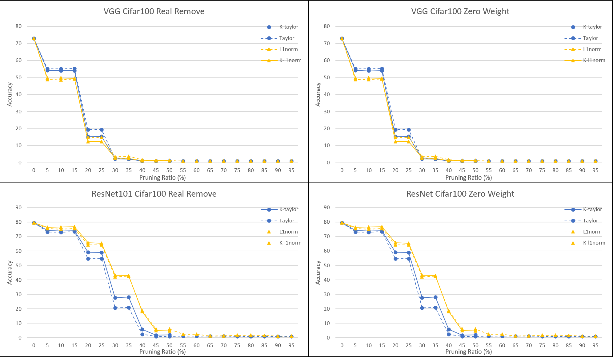
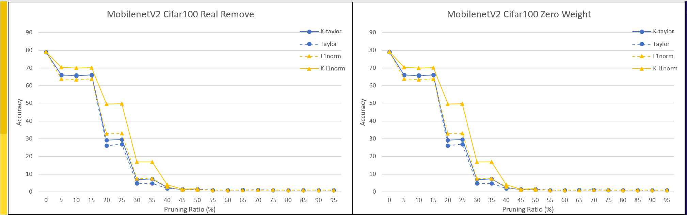
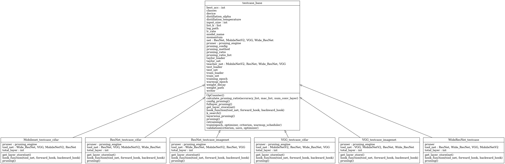

# Pruning Engine
## Introduction
This project is a pruning engine for neural network models. It provides a set of tools and methods for pruning the weights and filters of neural networks. Pruning is a technique used to reduce the size of neural networks by removing unnecessary parameters, improving model efficiency, and reducing computational resources required for model inference.

## Experiment Result
<p align="center">


<br>
<i>Figure 1: Experiment Result</i>
</p>

### Pretrain Weight for reproduce the experiment

[Cifar1000](https://drive.google.com/drive/folders/1RrpnG1uB4iSmO42wDwqBtjmiDbXYTXSg?usp=sharing)

[Cifar10](https://drive.google.com/drive/folders/1U8026-eHAmo5xbqYqXAvMaGjIf9aH9ql?usp=sharing)
## Installation
To install the project, follow these steps:


Clone the repository: 
```bash
git clone https://github.com/MIC-Laboratory/CNN-Pruning-Engine.git
```
Install the dependencies: 
```bash
pip install -r requirements.txt
```

## Usage
To use the pruning engine, follow these steps:

1. Import the pruning engine module: 
```python 
from Pruning_engine import pruning_engine
```
2. Create an instance of the pruning engine: 
```python
pruner = pruning_engine.PruningEngine(pruning_method="L1norm",individual = True)
```
3. Load your neural network model: 
```python
from torchvision.models import vgg16_bn,VGG16_BN_Weights
weights = VGG16_BN_Weights.DEFAULT
model = vgg16_bn(weights=weights)
device = torch.device('cuda:0' if torch.cuda.is_available() else 'cpu')
model.to(device)
```
4. Based on the structure of the Neural Network, choose the layer that needs to be pruned. E.g. [VGG16](https://arxiv.org/abs/1409.1556)[[1]]()


VGG16 Configuration in Python Code

```
VGG(                                                                                                                                                                                                                          
  (features): Sequential(                                                                                                                                                                                                     
    (0): Conv2d(3, 64, kernel_size=(3, 3), stride=(1, 1), padding=(1, 1))                                                                                                                                                     
    (1): BatchNorm2d(64, eps=1e-05, momentum=0.1, affine=True, track_running_stats=True)                                                                                                                                      
    (2): ReLU(inplace=True)                                                                                                                                                                                                   
    (3): Conv2d(64, 64, kernel_size=(3, 3), stride=(1, 1), padding=(1, 1))                                                                                                                                                    
    (4): BatchNorm2d(64, eps=1e-05, momentum=0.1, affine=True, track_running_stats=True)                                                                                                                                      
    (5): ReLU(inplace=True)                                                                                                                                                                                                   
    (6): MaxPool2d(kernel_size=2, stride=2, padding=0, dilation=1, ceil_mode=False)                                                                                                                                           
    ...
  )
)
```

Let say if I want the first conv2d layer prune 10% of the filter, the following batchnorm layer also prune 10% and the following conv2d layer prune 10% of the kernel by using L1norm criterion

```python
pruned_layer = model.features[0]
pruner.set_pruning_ratio(0.1)
pruner.set_layer(pruned_layer,main_layer=True)
remove_filter_idx = pruner.get_remove_filter_idx()["current_layer"]
model.features[0] = pruner.remove_filter_by_index(remove_filter_idx)

pruned_layer = model.features[1]
pruner.set_pruning_ratio(0.1)
pruner.set_layer(pruned_layer)
remove_filter_idx = pruner.get_remove_filter_idx()["current_layer"]
model.features[1] = pruner.remove_Bn(remove_filter_idx)

pruned_layer = model.features[3]
pruner.set_pruning_ratio(0.1)
pruner.set_layer(pruned_layer)
remove_filter_idx = pruner.get_remove_filter_idx()["current_layer"]
model.features[3] = pruner.remove_kernel_by_index(remove_filter_idx)

```

5. Retrain the model, reference to the training repo: https://github.com/MIC-Laboratory/Pytorch-Cifar

6. Save the pruned model: 
```python
torch.save(model, 'path_to_pruned_model.pt')
```

## Pruning Methods
The pruning engine supports multiple pruning methods, including:

- L1 norm pruning: Removes least important weights based on their L1 norm.
- K-means clustering pruning: Clusters weights and removes weak clusters based on their importance.
- Taylor pruning: Measures weight importance using the Taylor expansion and removes less important weights.

## Project Structure
### Pruning Engine Architecture
<p align="center">

<br>
<i>Figure 2: Pruning Engine UML diagram</i>
</p>

| Functions Name | Description |
| --- | --- |
| Pruning_base | Provides basic pruning functionalities such as removing filters by index and kernels by index. |
| Kmean_base | Offers basic K-means clustering pruning algorithms. Given weights, k, and a sorting method within each group, it returns the indices of filters that are not important. |
| Pruning_engine | Main file for the pruning engine, integrating all the pruning methods. |
| K_L1norm | Implements K-means clustering to cluster similar CNN filters and uses L1 norm to sort the filters within each cluster. |
| K_Taylor | Applies K-means clustering to cluster similar filters and uses Taylor estimation to sort the filters within each cluster. |
| L1norm | Pruning method that considers filters with the least magnitude as non-important. |
| Taylor | Pruning method that computes the product of feature maps and gradients for each filter, with smaller values indicating less importance. |

### Add your custom pruning criterion, 

1. Create a Python file within the "pruning_criterion" folder, containing your pruning algorithm. This file should include a function that accepts the layer weight as a parameter and return ranks the filters based on their importance using your specific algorithm.
2. In the pruning engine file, follow the structure of other pruning methods. In the \_\_init\_\_ function of the Pruning Engine, initialize your distinct pruning algorithm, similar to the way other methods are initialized.

### Test Case Architecture
<p align="center">

<br>
<i>Figure 3: Testcase UML diagram</i>
</p>

### Adding a custom network.
To incorporate your own network for the pruning experiment, 

1. Place your model file in the "Models" folder, and then initialize the new network in "testcase_base.py".
2. Create a new Python file in the "Example" folder for pruning your model, along with the corresponding config file. This file should include the following fully implemented functions: pruning, hook_function, and get_layer_store. These functions are essential for implementing the K-means and Taylor-related pruning methods. You can refer to the examples of other networks to implement them.

Here is a brief description of each function:

| Function Name | Description |
| --- | --- |
| pruning | This function is used to remove filters and kernels from the CNN. It does not have any return values or parameters. |
| hook_function | This function allows you to hook the feature map and gradient of filters in the CNN. It is required for the Taylor relative pruning algorithm. |
| get_layer_store | This function specifies the layers used to store additional pruning information, such as the number of clusters in the K-means algorithm. These layers should be the same ones that you want to hook the feature map and gradient to. |

## Reference
<a id="1">[1]</a> Simonyan, K. and Zisserman, A., 2014. Very deep convolutional networks for large-scale image recognition. arXiv preprint arXiv:1409.1556.

## Contributing
Contributions to this project are welcome. If you find any bugs or have suggestions for new features, please open an issue on the GitHub repository.

## License
This project is licensed under the MIT License. See the LICENSE file for more information.