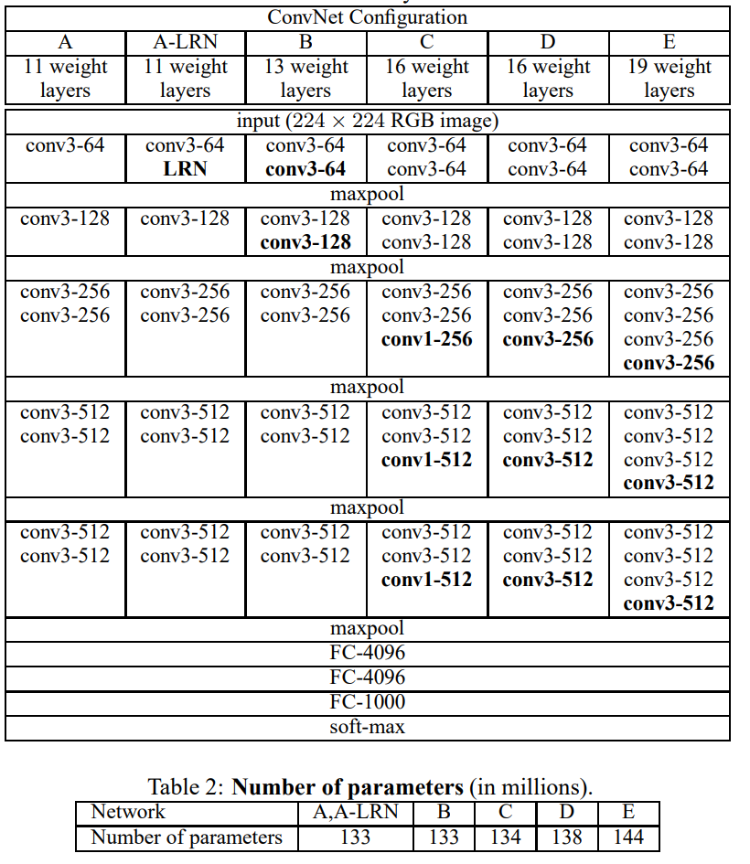

# Pruning Engine
## Introduction
This project is a pruning engine for neural network models. It provides a set of tools and methods for pruning the weights and filters of neural networks. Pruning is a technique used to reduce the size of neural networks by removing unnecessary parameters, improving model efficiency, and reducing computational resources required for model inference.
## Installation
To install the project, follow these steps:


Clone the repository: 
```bash
git clone https://github.com/example/project.git
```
Install the dependencies: 
```bash
pip install -r requirements.txt
```

## Usage
To use the pruning engine, follow these steps:

1. Import the pruning engine module: 
```python 
from Pruning_engine import pruning_engine
```
2. Create an instance of the pruning engine: 
```python
pruner = pruning_engine.PruningEngine(pruning_method="L1norm",individual = True)
```
3. Load your neural network model: 
```python
from torchvision.models import vgg16_bn,VGG16_BN_Weights
weights = VGG16_BN_Weights.DEFAULT
model = vgg16_bn(weights=weights)
device = torch.device('cuda:0' if torch.cuda.is_available() else 'cpu')
model.to(device)
```
4. Based on the structure of the Neural Network, choose the layer that needs to be pruned. E.g. [VGG16](https://arxiv.org/abs/1409.1556)[[1]]()

VGG16 Configuration



VGG16 Configuration in Python Code

```
VGG(                                                                                                                                                                                                                          
  (features): Sequential(                                                                                                                                                                                                     
    (0): Conv2d(3, 64, kernel_size=(3, 3), stride=(1, 1), padding=(1, 1))                                                                                                                                                     
    (1): BatchNorm2d(64, eps=1e-05, momentum=0.1, affine=True, track_running_stats=True)                                                                                                                                      
    (2): ReLU(inplace=True)                                                                                                                                                                                                   
    (3): Conv2d(64, 64, kernel_size=(3, 3), stride=(1, 1), padding=(1, 1))                                                                                                                                                    
    (4): BatchNorm2d(64, eps=1e-05, momentum=0.1, affine=True, track_running_stats=True)                                                                                                                                      
    (5): ReLU(inplace=True)                                                                                                                                                                                                   
    (6): MaxPool2d(kernel_size=2, stride=2, padding=0, dilation=1, ceil_mode=False)                                                                                                                                           
    (7): Conv2d(64, 128, kernel_size=(3, 3), stride=(1, 1), padding=(1, 1))                                                                                                                                                   
    (8): BatchNorm2d(128, eps=1e-05, momentum=0.1, affine=True, track_running_stats=True)                                                                                                                                     
    (9): ReLU(inplace=True)                                                                                                                                                                                                   
    (10): Conv2d(128, 128, kernel_size=(3, 3), stride=(1, 1), padding=(1, 1))                                                                                                                                                 
    (11): BatchNorm2d(128, eps=1e-05, momentum=0.1, affine=True, track_running_stats=True)                                                                                                                                    
    (12): ReLU(inplace=True)                                                                                                                                                                                                  
    (13): MaxPool2d(kernel_size=2, stride=2, padding=0, dilation=1, ceil_mode=False)                                                                                                                                          
    (14): Conv2d(128, 256, kernel_size=(3, 3), stride=(1, 1), padding=(1, 1))                                                                                                                                                 
    (15): BatchNorm2d(256, eps=1e-05, momentum=0.1, affine=True, track_running_stats=True)                                                                                                                                    
    (16): ReLU(inplace=True)                                                                                                                                                                                                  
    (17): Conv2d(256, 256, kernel_size=(3, 3), stride=(1, 1), padding=(1, 1))                                                                                                                                                 
    (18): BatchNorm2d(256, eps=1e-05, momentum=0.1, affine=True, track_running_stats=True)                                                                                                                                    
    (19): ReLU(inplace=True)                                                                                                                                                                                                  
    (20): Conv2d(256, 256, kernel_size=(3, 3), stride=(1, 1), padding=(1, 1))                                                                                                                                                 
    (21): BatchNorm2d(256, eps=1e-05, momentum=0.1, affine=True, track_running_stats=True)                                                                                                                                    
    (22): ReLU(inplace=True)                                                                                                                                                                                                  
    (23): MaxPool2d(kernel_size=2, stride=2, padding=0, dilation=1, ceil_mode=False)                                                                                                                                          
    (24): Conv2d(256, 512, kernel_size=(3, 3), stride=(1, 1), padding=(1, 1))
    (25): BatchNorm2d(512, eps=1e-05, momentum=0.1, affine=True, track_running_stats=True)
    (26): ReLU(inplace=True)
    (27): Conv2d(512, 512, kernel_size=(3, 3), stride=(1, 1), padding=(1, 1))
    (28): BatchNorm2d(512, eps=1e-05, momentum=0.1, affine=True, track_running_stats=True)
    (29): ReLU(inplace=True)
    (30): Conv2d(512, 512, kernel_size=(3, 3), stride=(1, 1), padding=(1, 1))
    (31): BatchNorm2d(512, eps=1e-05, momentum=0.1, affine=True, track_running_stats=True)
    (32): ReLU(inplace=True)
    (33): MaxPool2d(kernel_size=2, stride=2, padding=0, dilation=1, ceil_mode=False)
    (34): Conv2d(512, 512, kernel_size=(3, 3), stride=(1, 1), padding=(1, 1))
    (35): BatchNorm2d(512, eps=1e-05, momentum=0.1, affine=True, track_running_stats=True)
    (36): ReLU(inplace=True)
    (37): Conv2d(512, 512, kernel_size=(3, 3), stride=(1, 1), padding=(1, 1))
    (38): BatchNorm2d(512, eps=1e-05, momentum=0.1, affine=True, track_running_stats=True)
    (39): ReLU(inplace=True)
    (40): Conv2d(512, 512, kernel_size=(3, 3), stride=(1, 1), padding=(1, 1))
    (41): BatchNorm2d(512, eps=1e-05, momentum=0.1, affine=True, track_running_stats=True)
    (42): ReLU(inplace=True)
    (43): MaxPool2d(kernel_size=2, stride=2, padding=0, dilation=1, ceil_mode=False)
  )
  (avgpool): AdaptiveAvgPool2d(output_size=(7, 7))
  (classifier): Sequential(
    (0): Linear(in_features=25088, out_features=4096, bias=True)
    (1): ReLU(inplace=True)
    (2): Dropout(p=0.5, inplace=False)
    (3): Linear(in_features=4096, out_features=4096, bias=True)
    (4): ReLU(inplace=True)
    (5): Dropout(p=0.5, inplace=False)
    (6): Linear(in_features=4096, out_features=1000, bias=True)
  )
)
```

Let say if I want the first conv2d layer prune 10% of the filter, the following batchnorm layer also prune 10% and the following conv2d layer prune 10% of the kernel by using L1norm criterion

```python
pruned_layer = model.features[0]
pruner.set_pruning_ratio(0.1)
pruner.set_layer(pruned_layer,main_layer=True)
sorted_idx = pruner.get_sorted_idx()["current_layer"]
model.features[0] = pruner.remove_filter_by_index(sorted_idx)

pruned_layer = model.features[1]
pruner.set_pruning_ratio(0.1)
pruner.set_layer(pruned_layer)
sorted_idx = pruner.get_sorted_idx()["current_layer"]
model.features[1] = pruner.remove_Bn(sorted_idx)

pruned_layer = model.features[3]
pruner.set_pruning_ratio(0.1)
pruner.set_layer(pruned_layer)
sorted_idx = pruner.get_sorted_idx()["current_layer"]
model.features[3] = pruner.remove_kernel_by_index(sorted_idx)

```

5. Retrain the model, reference to the training repo: https://github.com/MIC-Laboratory/Pytorch-Cifar

6. Save the pruned model: 
```python
torch.save(model, 'path_to_pruned_model.pt')
```

## Pruning Methods
The pruning engine supports multiple pruning methods, including:

- L1 norm pruning: Removes least important weights based on their L1 norm.
- K-means clustering pruning: Clusters weights and removes weak clusters based on their importance.
- Taylor pruning: Measures weight importance using the Taylor expansion and removes less important weights.

## Project Structure
The project has the following structure:
- Pruning_engine/: Contains the source code of the pruning engine.
- Models/: Contains neural network models and related modules.
- Pruning_criterion/: Contains different pruning criteria implementation.
- Example/: Contains example test cases for pruning and retraining on various models.
- Weapon/: Contains utility classes and functions used by the pruning engine.

```bash
├── Pruning_engine/
│   ├── pruning_engine.py
│   ├── pruning_engine_base.py
│   └── ...
├── Models/
│   ├── Resnet.py
│   ├── Vgg.py
│   ├── Mobilenetv2.py
│   └── ...
├── Pruning_criterion/
│   ├── L1norm/
│   │   └── L1norm.py
│   ├── KMean/
│   │   ├── Kmean_base.py
│   │   └── ...
│   ├── Taylor/
│   │   ├── K_Taylor.py
│   │   └── ...
│   └── ...
├── Example/
│   ├── utils.py
│   ├── Mobilenet_testcase.py
│   ├── testcase_base.py
│   ├── VGG_testcase.py
│   ├── ResNet_testcase.py
│   └── ...
├── Weapon/
│   ├── WarmUpLR.py
│   ├── RandomMixUp.py
│   └── ...
├── LICENSE
├── README.md
├── requirements.txt
└── ...
```

## Reference
<a id="1">[1]</a> Simonyan, K. and Zisserman, A., 2014. Very deep convolutional networks for large-scale image recognition. arXiv preprint arXiv:1409.1556.

## Contributing
Contributions to this project are welcome. If you find any bugs or have suggestions for new features, please open an issue on the GitHub repository.

## License
This project is licensed under the MIT License. See the LICENSE file for more information.