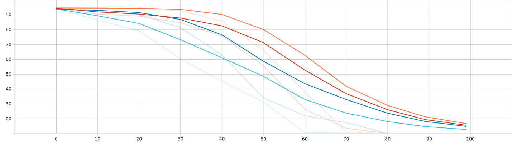

# Pytorch-CNN-Pruning
## Environment Setup:
```conda create --name Pytorch --file conda-environment.yml```

## Platforms
- Ubuntu 18.04
- Pytorch=1.10.1
- py3.9
- cuda10.2
- cudnn7.6.5_0


## TensorBoard Commend:
```tensorboard --logdir [Directory]```

If you obtain PORT problem, can use the commend below to change ports.


```--port = [PORT]```


## MobilenetV2 Pruning Result

Labels:


ACC:



Flops:

.svg)

Params:

.svg)
